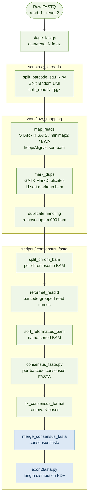

# cLFR Consensus FASTA Workflow

Standalone release of the cLFR consensus FASTA workflow extracted from [LFR_Pipeline](https://github.com/Complete-Genomics/LFR_Pipeline).

This release keeps the full FASTQ-to-consensus path needed for cLFR consensus fragment generation.



It intentionally excludes unrelated full-pipeline branches such as variant calling, benchmarking, 16S analysis, de novo assembly, and full summary-report generation.

## Contents

```text
cLFR_Release/
├── config/
│   └── consensus_fasta.yaml
├── scripts/
│   ├── split_barcode_stLFR.py
│   ├── consensus_fasta.py
│   ├── consensus_fasta_supp.py
│   └── exon2fasta.py
├── workflow/
│   └── consensus_fasta.smk
└── environment.yml
```
### Requirements
***Hardware requirements***
Minimum 256GB RAM 
***Software requirements***
Linux CentOS >=7

## Install

```bash
mamba env create -f environment.yml
mamba activate clfr-consensus-fasta
```

The environment includes Snakemake, Python, GATK4, samtools, stringtie, pigz, pysam, Biopython, and the supported mappers. `samtools>=1.22` is recommended because this workflow can optionally use `samtools consensus -T`.

## Configure

Copy [config/consensus_fasta.yaml](config/consensus_fasta.yaml) to your run folder as `consensus_fasta.yaml`, then edit it. The workflow reads `consensus_fasta.yaml` from the run folder, while scripts are resolved from the release source directory.

```yaml
sample_id: data
chroms: [chr1, chr2]

inputs:
  read1: /path/to/read_1.fq.gz
  read2: /path/to/read_2.fq.gz

paths:
  output_dir: Align
  ref_fasta: /path/to/genome.fa

# For SE600 use minimap2; for PE150 use hisat2.
mapping:
  mapper: hisat2
  hisat2_index: /path/to/hisat2_index
  hisat2_splicesites: /path/to/splicesites.txt

params:
  sequence_type: pe
  bc_condition: random_bc
  umi_len: 15
  read_len: 150
  read_len_r1: 150
  min_reads: 50
  num_splits: 5
  use_samtools_reference: false
```

Key settings:

- `inputs.read1/read2`: raw input FASTQ files. For single-end data, set `params.sequence_type: se`; `read1` may be blank, and the workflow processes `read2`.
- `chroms`: contigs to emit consensus FASTA from; names must match the mapping reference and BAM contigs.
- `paths.output_dir`: main output directory, default `Align`.
- `paths.ref_fasta`: genome FASTA used by `samtools consensus` during consensus generation. This is still required for consensus even when mapping uses STAR or HISAT2 indexes.
- `mapping.mapper`: one of `star`, `hisat2`, `minimap2`, or `bwa`.
- `mapping.ref_fasta`: optional mapping reference FASTA for `bwa` and `minimap2`; defaults to `paths.ref_fasta` when omitted. Do not set it for STAR/HISAT2 unless you also use it as documentation for the index source.
- `mapping.star_index`: required when `mapping.mapper: star`.
- `mapping.hisat2_index` and `mapping.hisat2_splicesites`: required when `mapping.mapper: hisat2`.
- `mapping.minimap2_preset` and optional `mapping.minimap2_anno_bed`: used when `mapping.mapper: minimap2`.
- `tools.*`: executable paths. Defaults assume tools are available on `PATH` inside the conda environment.
- `tools.gatk`: GATK executable used for `MarkDuplicates`.
- `params.bc_condition`: duplicate barcode tag mode; `random_bc` uses `BX`, `standard` uses `BC`.
- `params.umi_len`: cLFR barcode length retained from read names.
- `params.min_reads`: minimum reads required for one barcode group to generate consensus.
- `params.num_splits`: per-chromosome read-count chunks used to parallelize consensus generation.
- `params.use_samtools_reference`: default `false`. When enabled, `samtools consensus -T <ref.fa>` fills zero-coverage bases from the reference, but it can add substantial runtime/I/O cost, so the release keeps it off by default.

## Run

```bash
# Run this from the folder containing consensus_fasta.yaml.
smk=/path/to/cLFR_Release/workflow/consensus_fasta.smk
num_cpu=30
snakemake -s ${smk} --cores ${num_cpu} -p -k 2> consensus.err.txt
```

Main output:

```text
Align/consensus/consensus.fasta
```

Additional outputs include:

```text
data/split_read.1.fq.gz
data/split_read.2.fq.gz
keep/Align/{sample_id}.sort.bam
keep/Align/{sample_id}.sort.markdup.bam
Align/{sample_id}_dedup_metrics.txt
Align/{sample_id}.sort.removedup_rm000.bam
Make_Vcf/step3_hapcut/step1_modify_bam/{sample_id}_sort.markdup_{chrom}.bam
Align/consensus/consensus_frag_length_distribution.pdf
Align/consensus/frag_length_distribution.txt
```

## Notes

The `Make_Vcf/step3_hapcut/step1_modify_bam` path is preserved only because the original consensus module used that location for per-chromosome BAMs. This standalone workflow creates those BAMs directly with `samtools view`; it does not run variant calling or HapCUT2.

For `random_bc`, duplicate-marked BAMs are preserved for downstream consensus semantics. For `standard`, reads flagged as duplicates are removed before consensus.

`params.use_samtools_reference` controls whether `samtools consensus` receives `-T <ref.fa>`. Leave it as `false` for faster default runs. Turn it on only when zero-coverage positions should be filled from the reference and the extra cost is acceptable.

## Release Checklist

Before tagging a GitHub release:

```bash
python -m py_compile scripts/*.py
snakemake -s /path/to/cLFR_Release/workflow/consensus_fasta.smk --cores 1 -n
```

Then run the workflow on a small FASTQ pair and confirm:

```text
Align/consensus/consensus.fasta
Align/consensus/consensus_frag_length_distribution.pdf
Align/consensus/frag_length_distribution.txt
```

## Origin

Extracted from:

```text
LFR_Pipeline/modules/shared/splitreads/
LFR_Pipeline/modules/clfr/align/
LFR_Pipeline/modules/clfr/consensus_fasta/
```

The release version removes local hard-coded tool/reference paths and keeps only the FASTQ-to-consensus FASTA workflow.
